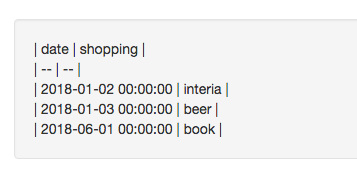

# What this app can do ?

This app can convert Excel or csv file to markdown table.

Choose your Excel file via web browser.


After push the "Upload" button, markdown table is generated.



# How to use

### Requirements

* Docker and Docker Compose

### Setup

First, please download this repo's souece codes.

```
$ git clone https://github.com/ao-log/excel_to_MarkdownTable
```

This app run on docker container. So, please build docker image by the following command.

```
$ docker-compose build
```

After build images, please run container.

```
$ docker-compose up -d
```

Now, ready to use this app.
Please access web interface. URL is http://localhost:5000/.

